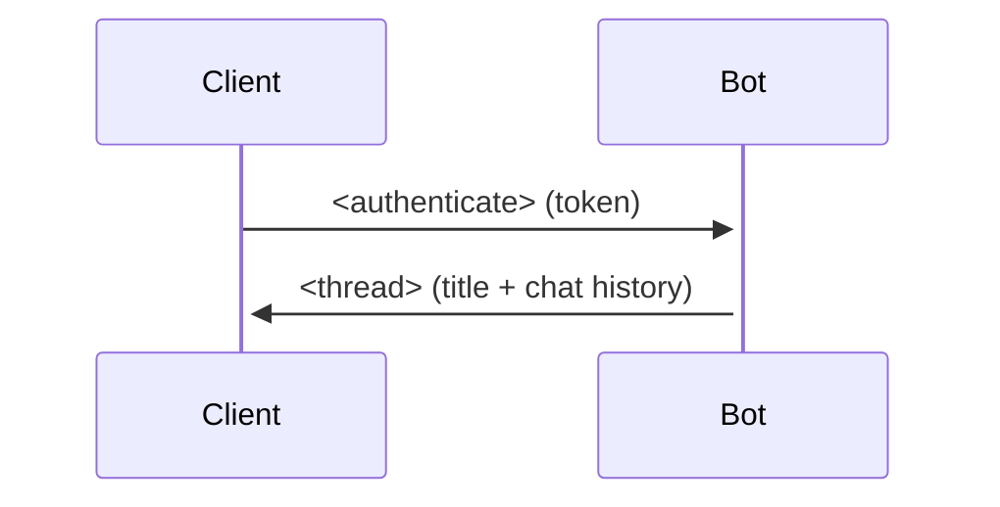
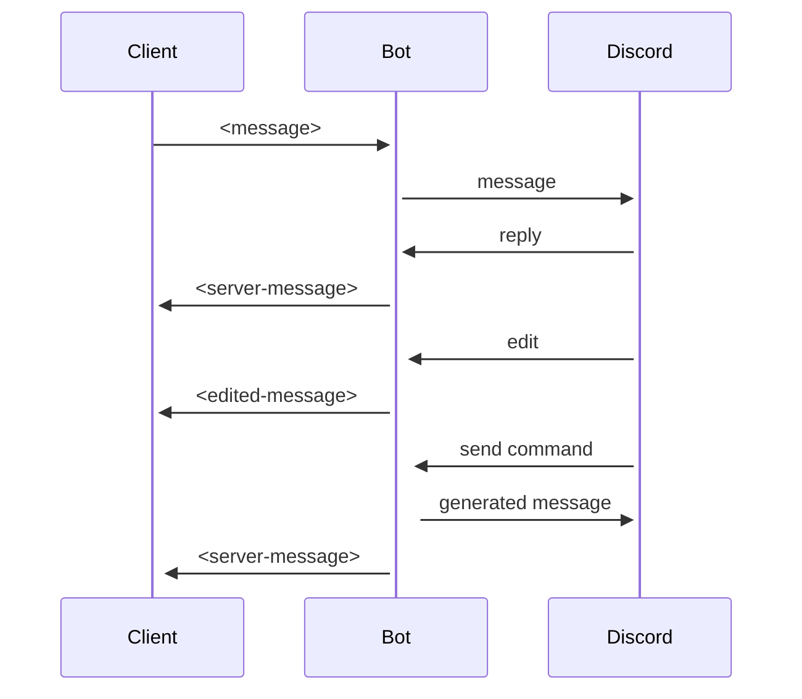
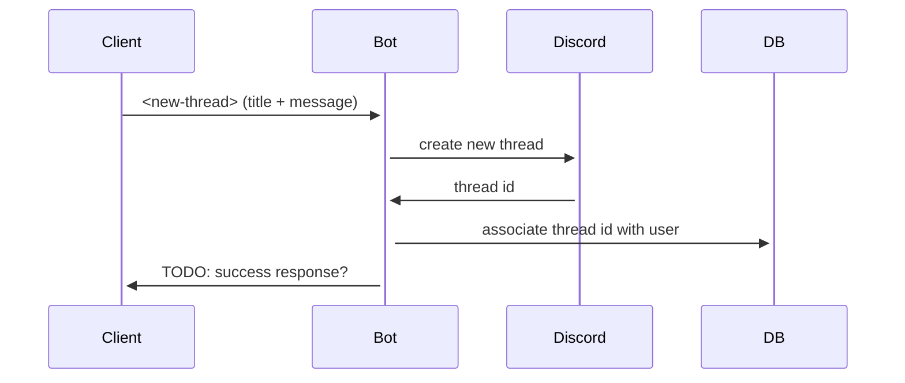
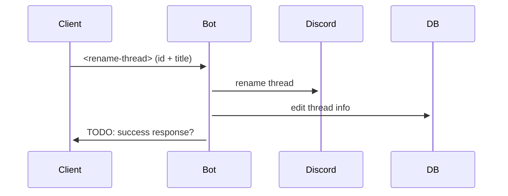
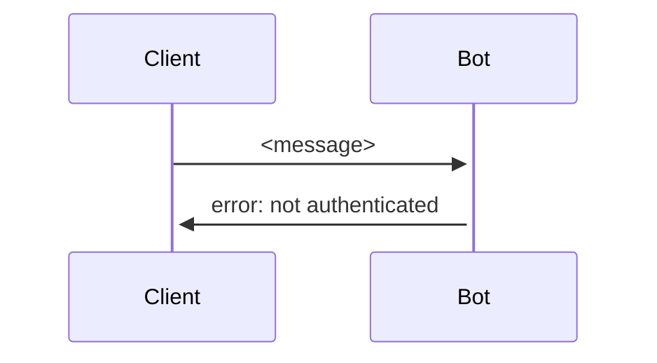

## Messages

### Client to Server

- `authenticate` - log in via token
- `message`
- `new-thread` - sent with the name of the thread, and the contents of the first
  message
- `rename-thread` - sent with the thread id, and the new name

### Server to Client

- `thread` - sent when first logging in, and when changing and creating threads.
  contains thread id.
- `server-message` - sent when a Discord message is forwarded

## Standard flows

### Authentication

### Communication with Discord

### Thread manipulation

#### New thread

#### Rename thread

## Error flows

